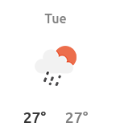
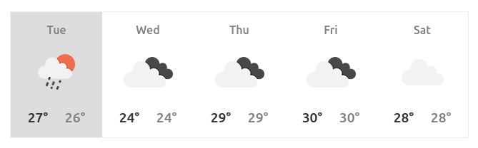

## Weather App      
This is a simple weather app that will pull data from an weather API and display the information.  

### Part I
Get data from a weather API

**What data is needed?**
- High temps for today (any location)
- Low Temps for today ( any location)
- Reference to the icon that will be dispalyed to match weather
- High Temps for the next 4 days 
- Low Temps for the next 4 days. 

### Part II
Display the weather for today.  

It should look something like this: 

### Part III
Create a 5-day forecast.

If should look something like this:

